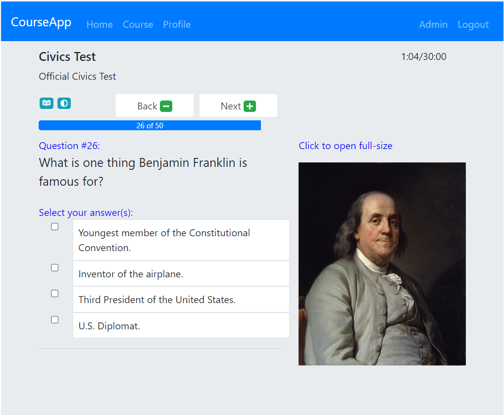
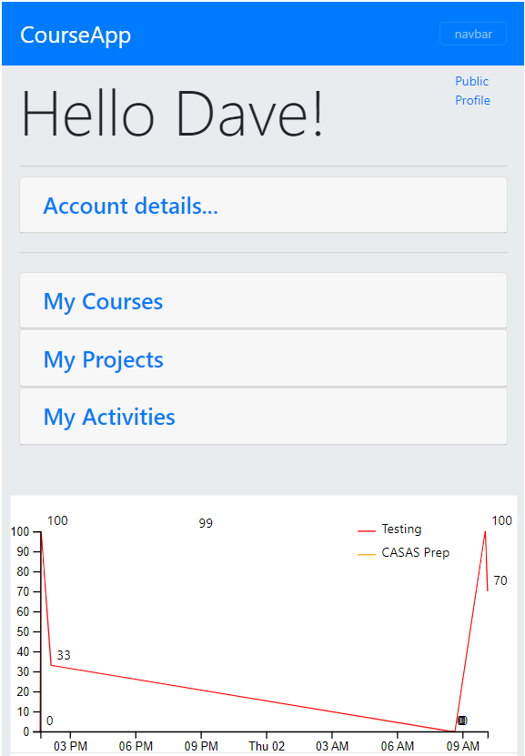

## Quizzap!

#### Copyright Norton 2025

Claude 3.7 summarized the application as follows:

The legacy JavaScript application (Quizzap!) is a course management platform built with:

* **Backend** : Node.js with Express
* **Database** : MongoDB with Mongoose ODM
* **Authentication** : Passport.js with local strategy
* **View Engine** : Handlebars (HBS)
* **UI Framework** : Bootstrap with jQuery

The key functionalities include:

1. **User Authentication**
   * Login/register system
   * Role-based access (student, teacher, admin)
2. **Course Management**
   * Creating and managing courses
   * Assigning instructors to courses
   * Student enrollment
3. **Quiz System**
   * Creating/editing quizzes with multiple question types
   * Quiz attempts tracking
   * Timer functionality
   * Grading system with pass/fail criteria
   * Project submissions
4. **Discussion Forums**
   * Thread creation by course
   * Replies with upvoting/downvoting
   * Moderation features
5. **Learning Content**
   * Course materials organized in modules
   * Media support (images, videos)

-----

This version assumes MongoDB is up and running on port 27017
and uses the DB called "CourseApp" (wiredtiger) by default.

Extract cdn.zip in current folder to create /cdn directory.

Versioning:

- 1.0.0: (2021) Initial version
- 1.0.1: (May 2024) Updated this readme.  :)

---

Only applicable to pm2-windows-service:

Auto-startup for pm2.exe service configured with pm2-windows-service module:

Launched Git Bash in Administrative Mode, then ran the following:

[ /c/util/courseApp/utils/yarn-pm2-windows-service/node_modules/pm2-windows-service ]

$ bin/pm2-service-install -n pm2
? Perform environment setup (recommended)? Y
? Set PM2_HOME? Y
? PM2_HOME value: c:\util\courseApp\utils\node
? Set PM2_SERVICE_SCRIPTS (the list of start-up scripts for pm2)? N
? Set PM2_SERVICE_PM2_DIR (the location of the global pm2 to use with the service? Y
? Specify the directory containing the pm2 version to be used by the service:
C:\util\courseApp\utils\node\node_modules\pm2

PM2 service installed and started.

Then again in administrative mode,

$ sc \\DESKTOP-83JAE79 config pm2.exe depend= MongoDB

To check pm2 services, login to cmd or bash in Administrative mode.

$ pm2 start /c/util/courseApp/server.js -i 1 --name courseApp
$ pm2 save

(The 'pm2 save' will cause pm2 to pick up from where it leaves off on the next restart.)

---

Manual startup of the production server:

Assuming the MongoDB process is running, start Quizzap! with:

pm2 start courseApp

... which essentially runs "node /c/util/courseApp/server.js" in daemon mode.

---

Logs are in C:\util\courseApp\utils\node\logs

---

Development mode (only applicable if you have the ./utils directory tree)

If you want to run in development mode with a standalone DB (mmapv1),
you can startup a local MongoDB using 'startDB.bat' instead (port 27018).
This DB has some data loaded already in the "nortonQuiz" DB instance.
Use F5 in Visual Studio Code to launch with .env settings.

---

TODO: Precompile the babelscript.  Currently only used for React timer component.

DeprecationWarning: Mongoose: mpromise (mongoose's default promise library)
is deprecated, plug in your own promise library instead:
http://mongoosejs.com/docs/promises.html

Express-Session Warning: connect.session() MemoryStore
is not designed for a production environment, as it will leak memory,
and will not scale past a single process.
